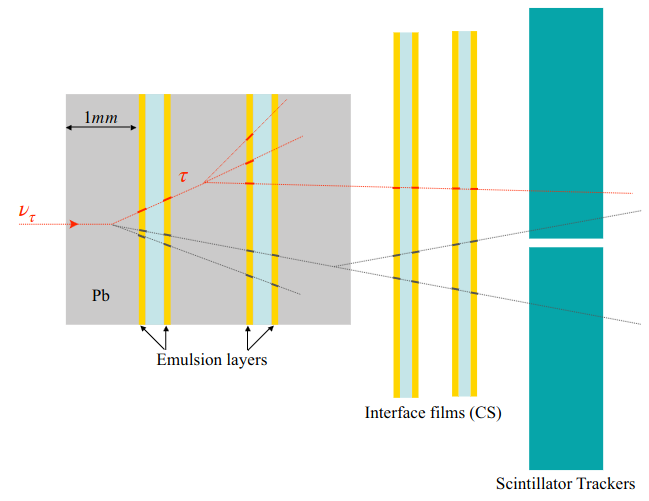
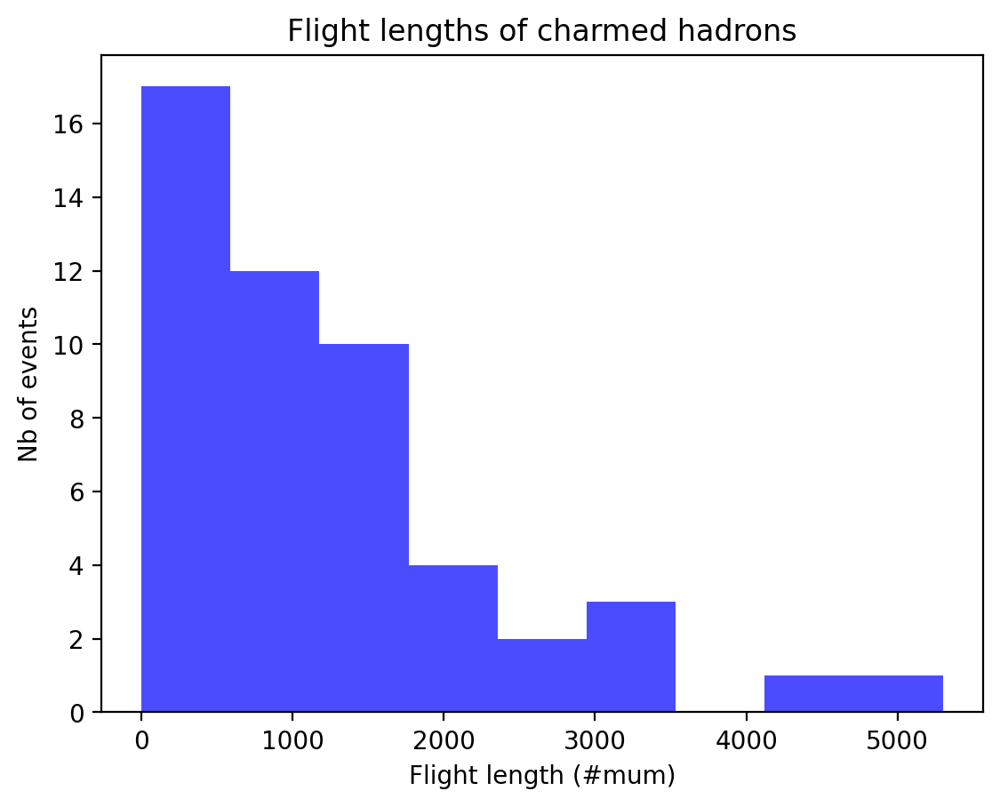
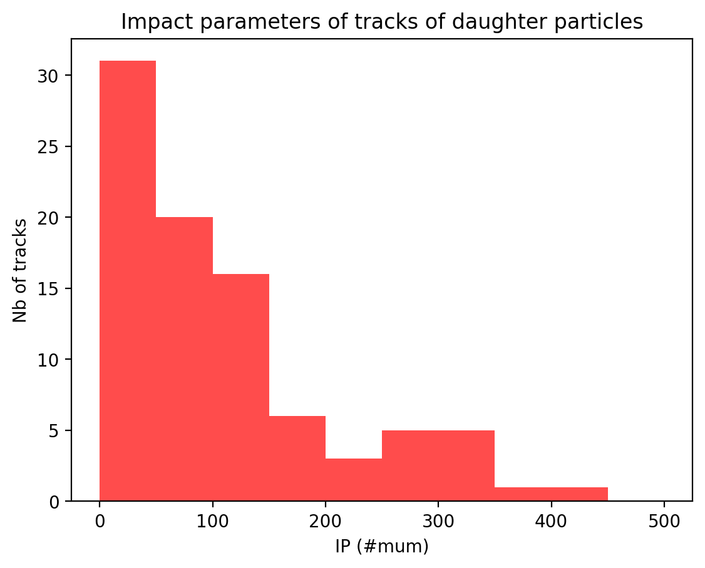
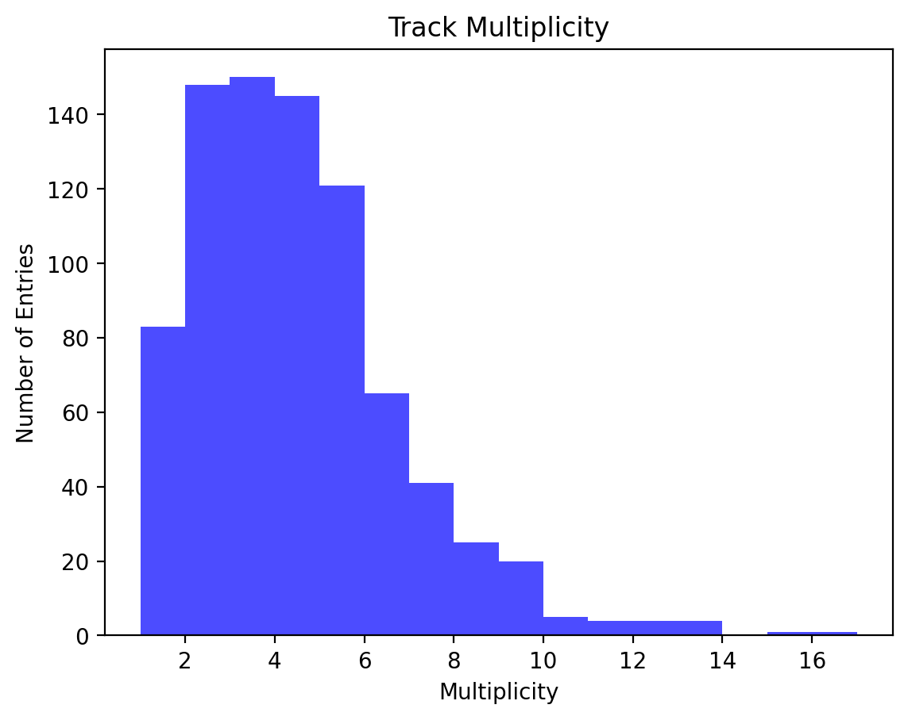
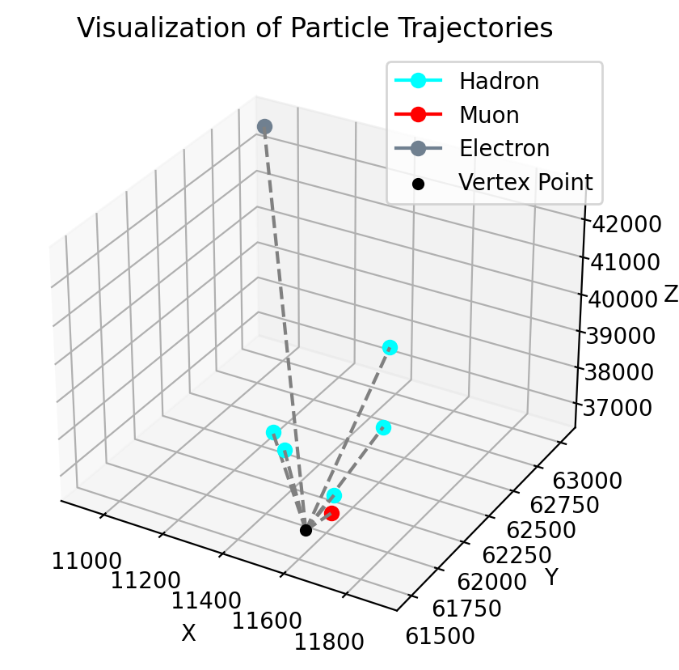
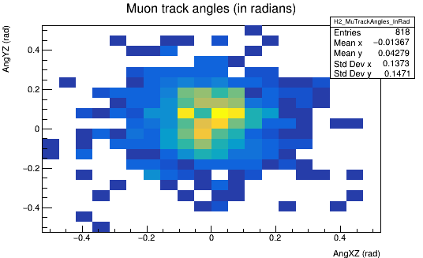
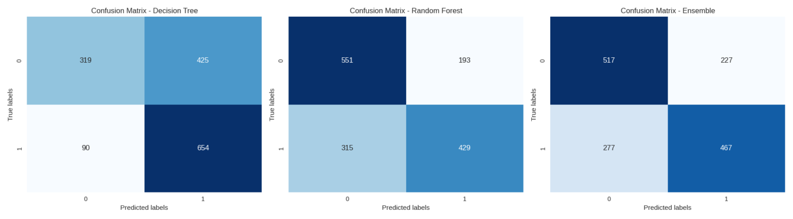
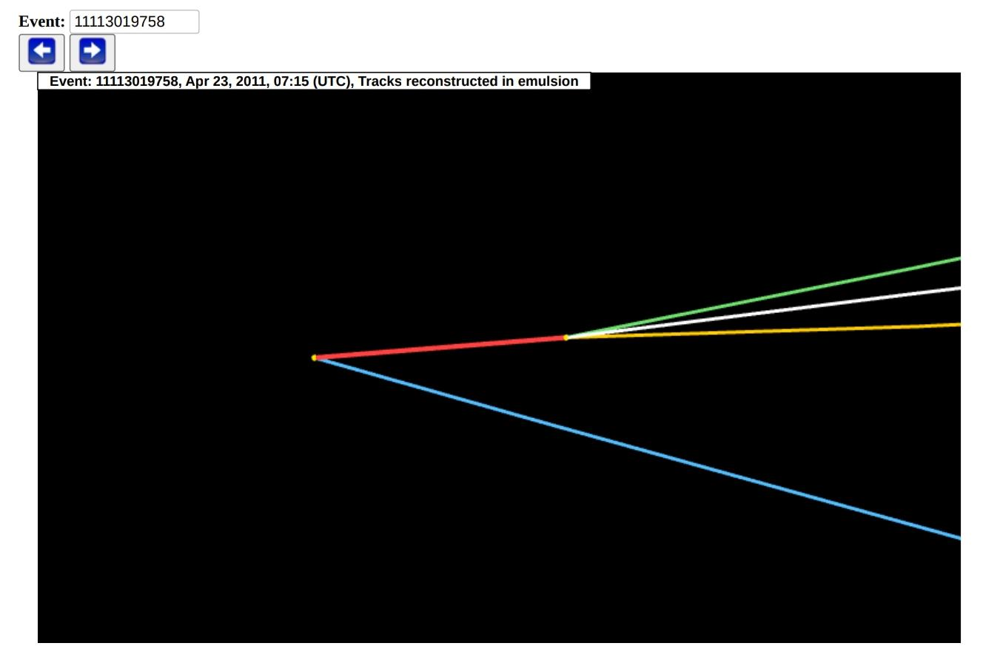

# Interactive Analysis and Visualization of Neutrino Event Topologies in the OPERA Experiment

This project was developed during the tenth wave of the INTEREST (INTErnational REmote Student Training at JINR) program under the supervision of Professor Dr. Sergey Dmitrievsky.

## Overview

This project focuses on analyzing data from the OPERA experiment, with an emphasis on neutrino oscillation detection. The analysis utilized data available from the CERN Open Data portal. By employing programming languages such as Python, C++, and JavaScript, the project explored the dynamics of particles produced in neutrino interactions.

## Table of Contents

- [Introduction](#introduction)
- [Data Analysis and Results](#data-analysis-and-results)
  - [Charmed Hadrons](#charmed-hadrons)
  - [Track Multiplicity](#track-multiplicity)
  - [Vertex and Track Reconstruction](#vertex-and-track-reconstruction)
- [Conclusions](#conclusions)

## Introduction

Neutrino oscillation is a quantum phenomenon where a neutrino changes flavor as it propagates through space. This effect, confirmed by the Super-Kamiokande experiment, provided crucial evidence that neutrinos have mass.

The OPERA experiment was designed to make the first direct observation of tau neutrinos resulting from the oscillation of muon neutrinos in a long-baseline beam from CERN to the Gran Sasso underground laboratory. The experiment employed an innovative combination of real-time electronic detectors and Emulsion Cloud Chamber (ECC) techniques to achieve high precision in tracking and identifying neutrino interactions.

## Data Analysis and Results

### Charmed Hadrons

Charmed hadrons can be detected in the OPERA experiment due to their decay topology being similar to that of tau leptons. The analysis of charmed hadron data utilized 50 candidate events.

- **Decay Length Distribution:** A graph was created to show the distribution of decay lengths for charmed hadrons. This distribution is essential for identifying decay patterns and validating the employed detection techniques.

- **Impact Parameter Distribution:** Another graph represented the distribution of impact parameters for the daughter particles resulting from charmed hadron decays. This graph is crucial for distinguishing charmed hadron events from other background events, helping to confirm the presence of these particles.

### Muon Neutrinos

Using data from muon neutrino interactions, the multiplicity of tracks and the angles of muon trajectories were analyzed, along with the development of a machine learning algorithm for binary classification.

- **Interactive Event Visualization:** An interactive visualization of the muon events was developed, where you can select a specific event and visualize the particle trajectories from the interaction point (vertex).

- **Track Multiplicity Histogram:** A histogram was created to represent the track multiplicity in muon neutrino interactions with lead in the OPERA detector. This graph allows for analyzing the distribution of tracks and verifying consistency with theoretical collision models.

- **Muon Trajectory Angles:** Additionally, the angles of muon trajectories were analyzed. A graph was created to show the distribution of these angles, which is important for understanding the kinematics of the produced particles.

- **Binary Classifier:** Given that each event includes a reconstructed muon in the final state, the analysis focused on developing a machine learning algorithm to create a binary classifier specifically designed to identify muons within the dataset. The classifier was implemented using techniques such as Decision Trees and Random Forest. Data preprocessing involved applying SMOTE to balance the classes. The Decision Tree performed well in identifying muons but faced challenges with false positives. Random Forest showed reasonable performance but exhibited signs of overfitting. An ensemble model was created to balance the approaches but still requires improvements in class distinction. All models were recorded in MLflow for future adjustments.

### Tau Neutrinos

For tau neutrino appearance studies, the OPERA experiment's emulsion data were used to detect tau neutrinos and extract detailed information about neutrino interaction topologies.

- **Three-Dimensional Visualization of Candidate Events:** A three-dimensional visualization was created to represent the topology of 10 tau neutrino candidate events. This visualization displayed primary and secondary vertices as well as the positions of reconstructed tracks to provide a clear understanding of the interaction dynamics and decay processes.

## Conclusions

The observation of 10 tau neutrino candidate events in the OPERA experiment marked a significant milestone in neutrino physics, confirming the three-flavor oscillation mechanism with a statistical significance of 6.1σ. This project successfully replicated several key analyses from the OPERA experiment, enhancing the understanding of neutrino physics and experimental detection techniques. The results were presented in an interactive dashboard developed with Streamlit.

## Author
This project was developed by Maria Gabriela Gomes. For more information or to connect, please visit my [LinkedIn profile](https://www.linkedin.com/in/maria-gabriela-gomes-27097431b?utm_source=share&utm_campaign=share_via&utm_content=profile&utm_medium=android_app).

